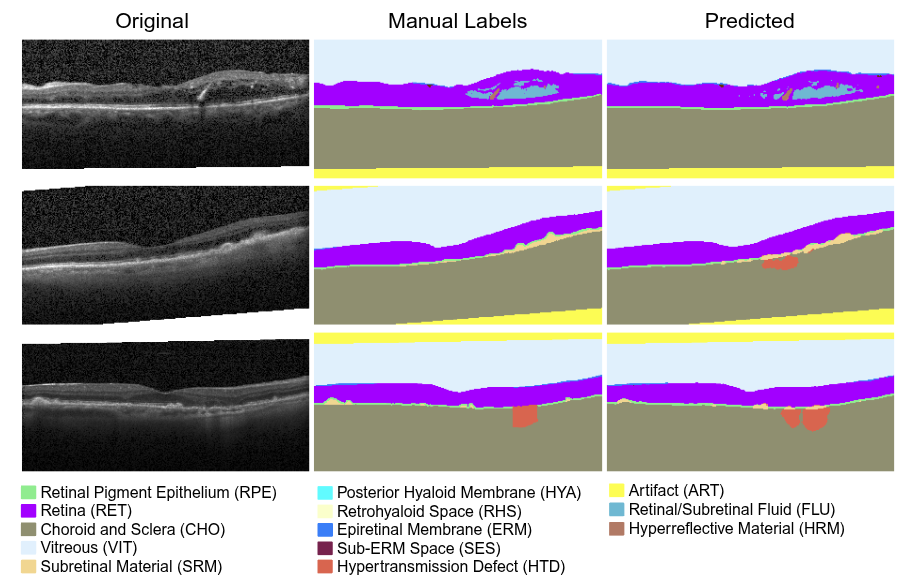

# OCTAVE (octvision3d)

This repository hosts the code, datasets, and documentation for the paper:

> **“Identifying Retinal Features Using a Self‑Configuring CNN for Clinical Intervention”**  
_Daniel S. Kermany, Wesley Poon, Anaya Bawiskar, Natasha Nehra, Orhun Davarci, Glori Das, Matthew Vasquez, Shlomit Schaal, Raksha Raghunathan & Stephen T. C. Wong
Invest. Ophthalmol. Vis. Sci., June 2, 2025; PMID 40525921_  
---



In this repository, we utilize nnUNet with a custom trainer class and the OCTAVE (**O**ptical **C**oherence **T**omography **A**nnotated **V**olume **E**xperiment) dataset to train a robust 3D segmentation model for detecting anatomic and pathological features in retinal optical coherence tomography (OCT) scans. The trained model is evaluated on four external and independent test sets.  
\
[Report Issue](https://github.com/Translational-Biophotonics-Laboratory/octvision3d/issues) · [Request Feature](https://github.com/Translational-Biophotonics-Laboratory/octvision3d/issues)

---

### Dataset Links

- [OCTAVE dataset](https://doi.org/10.5281/zenodo.14580071)
- [Rasti dataset](https://hrabbani.site123.me/available-datasets/dataset-for-oct-classification-50-normal-48-amd-50-dme)
- [Kafieh dataset](https://misp.mui.ac.ir/fa/node/1368)
- [Stankiewicz dataset](https://dsp.put.poznan.pl/cavri_database-191/)
- [Tian dataset](https://doi.org/10.1371/journal.pone.0133908.s002)

---

### Getting Started
#### Installation

1. Clone repository and submodule
    ```sh
    git clone --recurse-submodules git@github.com:Translational-Biophotonics-Laboratory/octvision3d.git
    ```

2. Install [PyTorch](https://pytorch.org/get-started/locally/) as described on their website (conda/pip). **DO NOT JUST INSTALL THIS LIBRARY OR NNUNET WITHOUT PROPERLY INSTALLING PYTORCH FIRST**

3. Install octvision3d and nnUNet. Use pip to install library and dependencies (virtual environment STRONGLY recommended)
    ```sh
    # After navigating to the octvision3d root directory (where setup.py is)
    pip install -e . && pip install -e ./nnUNet
    pip install -r requirements.txt
    ```

4. Setup essential environment variables ([instructions](https://github.com/MIC-DKFZ/nnUNet/blob/master/documentation/set_environment_variables.md))

#### Dataset Configuration

1. Download and extract the [OCTAVE dataset](https://doi.org/10.5281/zenodo.14580071)
   - The training data is found in `nnUNet_raw/Dataset001_OCTAVE`
   - The external validation data is found in `nnUNet_raw/external_tests`
2. The external validation labels is provided, but the images need to be downloaded from the original source links and preprocessed before inference
    - [Rasti dataset](https://hrabbani.site123.me/available-datasets/dataset-for-oct-classification-50-normal-48-amd-50-dme)
        - Rasti OCT volumes are provided as a series of single-page TIFF images inside a labeled folder (e.g. `NORMAL (16)/`) for each case.
        - First, `cd` into the downloaded Rasti dataset folder containing the folders `(AMD, Normal, DME)`
        - Then run the following shell command to convert each case to a multi-page TIFF with 19 b-scan slices saved to `./rasti_converted`
            ```sh
            for i in *; do
                for j in $i/*; do
                    python /path/to/octvision3d/downsample_slices.py --path $j --multifile --ext TIFF --output_dir ./rasti_converted --output_name "$(basename "$j").tif";
                done;
            done
            ```
        - Then, convert to nnUNet format using the following
          ```sh
          python /path/to/octvision3d/tif2nnUNet.py --path ./rasti_converted
          ```
        - Move `imagesTs` and `dataset.json` from `./rasti_converted/converted_nnUNet` to `OCTAVE/nnUNet_raw/external_tests/Rasti_nnUNet`
        - Finally, reshape the width and height of both images AND labels to match the training dataset
          ```sh
          python /path/to/octvision3d/reshape_images.py --image Rasti_nnUNet/imagesTs --label Rasti_nnUNet/labelsTs
          ```
        - The images and labels in the `imagesTs/reshaped` and `labelsTs/reshaped` folder are ready for inference.
          
    - [Tian dataset](https://doi.org/10.1371/journal.pone.0133908.s002)  
        - Tian OCT volumes are provided as a Matlab `.mat` for each case (e.g. `Subject1.mat`)
        - After downloading, run the following script on the folder with the `.mat` files to convert to a multi-page tiff in the output `./`
          ```sh
          python /path/to/octvision3d/convert_mat2tif.py --path ~/Downloads/PLOS_Tian_2015/ --key volumedata --output_dir tian_converted
          ```
        - The Tian dataset OCT volumes only have 10 b-scan slices, so we do not need to downsample
        - Next, convert to nnUnet format using the following
          ```sh
          python /path/to/octvision3d/tif2nnUNet.py --path ./tian_converted
          ```
        - Move `imagesTs` and `dataset.json` from `./tian_converted/converted_nnUNet` to `OCTAVE/nnUNet_raw/external_tests/Tian_nnUNet`
        - Finally, reshape the width and height of both images AND labels to match the training dataset
          ```sh
          python /path/to/octvision3d/reshape_images.py --image Tian_nnUNet/imagesTs --label Tian_nnUNet/labelsTs
          ```
        - The images and labels in the `imagesTs/reshaped` and `labelsTs/reshaped` folder are ready for inference.
      


### Additional Info

For more detailed information, it is HIGHLY recommended you read the nnUNet documentation:
>- [Installation instructions](documentation/installation_instructions.md)
>- [Dataset conversion](documentation/dataset_format.md)
>- [Usage instructions](documentation/how_to_use_nnunet.md)


