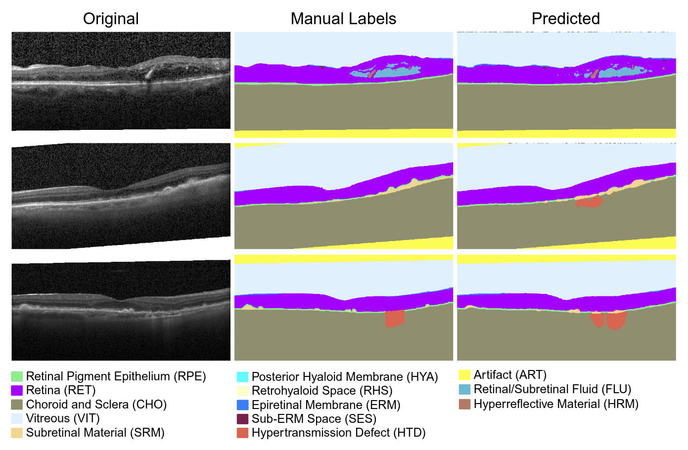

# OCTAVE (octvision3d)

This repository hosts the code, datasets, and documentation for the paper:

> **“Identifying Retinal Features Using a Self‑Configuring CNN for Clinical Intervention”**  
_Daniel S. Kermany, Wesley Poon, Anaya Bawiskar, Natasha Nehra, Orhun Davarci, Glori Das, Matthew Vasquez, Shlomit Schaal, Raksha Raghunathan & Stephen T. C. Wong
Invest. Ophthalmol. Vis. Sci., June 2, 2025; PMID 40525921_  
---



In this repository, we utilize nnUNet with a custom trainer class and the OCTAVE (**O**ptical **C**oherence **T**omography **A**nnotated **V**olume **E**xperiment) dataset to train a robust 3D segmentation model for detecting anatomic and pathological features in retinal optical coherence tomography (OCT) scans. The trained model is evaluated on four external and independent test sets.  
\
[Report Issue](https://github.com/Translational-Biophotonics-Laboratory/octvision3d/issues) · [Request Feature](https://github.com/Translational-Biophotonics-Laboratory/octvision3d/issues)

---

### Dataset Links

- [OCTAVE dataset](https://doi.org/10.5281/zenodo.14580071)
- [Rasti dataset](https://hrabbani.site123.me/available-datasets/dataset-for-oct-classification-50-normal-48-amd-50-dme)
- [Kafieh dataset](https://misp.mui.ac.ir/fa/node/1368)
- [Stankiewicz dataset](https://dsp.put.poznan.pl/cavri_database-191/)
- [Tian dataset](https://doi.org/10.1371/journal.pone.0133908.s002)

---

### Getting Started
#### Prerequisites

Clone repository and submodule
  ```sh
  git clone --recurse-submodules git@github.com:Translational-Biophotonics-Laboratory/octvision3d.git
  ```
Installation
  ```sh
  # After navigating to root directory (where setup.py is)
  pip install -e .
  ```

#### Dataset Configuration


#### nnUNet Setup

If you have not worked with nnUNet before, it is HIGHLY recommended you read these first:
>- [Installation instructions](documentation/installation_instructions.md)
>- [Dataset conversion](documentation/dataset_format.md)
>- [Usage instructions](documentation/how_to_use_nnunet.md)


